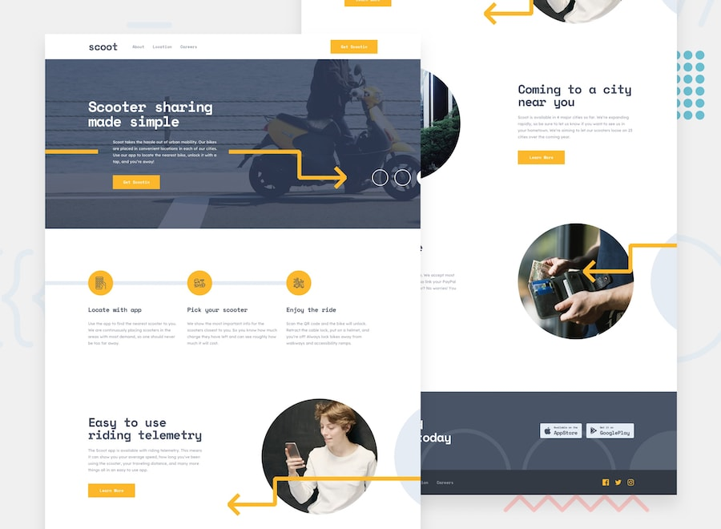

# FM--Scoot-Website--React-

Welcome to the official repository, which houses the source code and assets for a 4-page scooter sharing website of the fictional company, Scoot. This project utilizes Vite, React, React Router Dom, and SCSS to build a cutting-edge website experience.

The website aims to provide information about the service, its benefits, company values, locations, and available career opportunities. It is designed to be responsive, accessible, and user-friendly.

## Contents

- [Screenshot](#Screenshot)
- [Installation](#Installation)
- [Usage](#Usage)
- [Features](#Features)
- [Technologies Used](#Technologies-Used)
- [Contributing](#Contributing)

## Screenshot



## Installation

### Prerequisites

Before you begin, make sure you have the following tools installed:

<b>Node.js:</b> Make sure you have Node.js installed. You can download it from https://nodejs.org/.

### Step 1: Clone the Repository

Begin by cloning this repository to your local machine using Git:

```
git clone https://github.com/your-username/your-project.git
```

### Step 2: Navigate to the Project Directory

Navigate to the project directory that you just cloned:

```
cd your-project
```

### Step 3: Install Dependencies

Use npm to install the project dependencies:

```
npm install
```

This command will install all the necessary packages and libraries specified in the package.json file.

### Step 4: Start the Development Server

To start the development server and preview your application, run the following command:

```
npm run dev
```

This will start the development server using Vite, which provides fast and optimized development builds.

### Additional Configuration

```
npm run build
```

This will create an optimized build of your application in the dist directory.

## Usage

The Scoot website is designed to provide users with information about the scooter sharing service and the company itself. It offers a user-friendly interface with easy navigation between the different pages.

- <b>Home Page:</b> This page provides an overview of how to use the Scoot service and highlights its benefits. Users can download the Scoot app for Android or Apple devices.
- <b>About Page:</b> The About page offers additional information about the Scoot service, including more benefits, the company's values, and a frequently asked questions (FAQ) section. Users can download the app from this page as well.
- <b>Locations Page:</b> On the Locations page, users can view the cities where the Scoot service is available. If Scoot is not currently available in their city, they have the option to contact Scoot for more information. The app download section is also available on this page.
- <b>Careers Page:</b> The Careers page showcases why individuals should consider working for Scoot and provides a list of positions currently available. The app download section is included on this page as well.

## Features

- <b>Fixed Header:</b> The website features a fixed header that remains visible as users scroll through the content, providing easy access to navigation.
- <b>Interactive Navigation Closure:</b> The navigation menu can be closed using multiple methods for user convenience. Users can press the "Esc" key to close the menu, click outside the menu area, or when the focus is moved outside the navigation area. This ensures that users have control over the menu visibility and can focus on the website content.
- <b>Download App Links:</b> Each page includes prominent download links for the Scoot mobile app, available for both Android and Apple devices. Users can quickly access and download the app, enabling them to easily participate in the scooter sharing service.
- <b>Responsive and Accessible Design:</b> The website is designed to be responsive, ensuring optimal viewing and functionality across a range of devices and screen sizes. It offers a consistent and user-friendly experience for both desktop and mobile users. Additionally, the website follows accessibility best practices, making it accessible to users with disabilities.

## Technologies Used


## Contributing

Contributions to the Scoot website are welcome! If you find any issues or would like to suggest enhancements, please submit a pull request.
